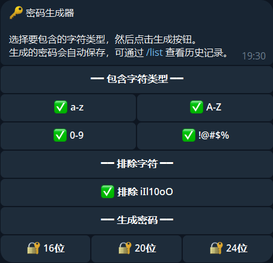

# Telegram Password Generator Bot

A private Telegram bot for generating random passwords and keeping a history of saved entries.

[中文说明 / Chinese README](./README_zh.md)

## Features

- Custom character sets: a-z, A-Z, 0-9, and `!@#$%`
- Excludes ambiguous characters: `iIl10oO`
- Quickly generates 16/20/24-character passwords
- **Manual save**: generated passwords are not stored unless you confirm via button
- **Instant refresh**: regenerate immediately if you do not like the current result
- Saved password history
- User access control

## Deployment Demo



## Installation

```bash
pip install -r requirements.txt
```

## Configuration

Create a `config.json` file:

```json
{
  "bot_token": "YOUR_BOT_TOKEN_HERE",
  "allowed_users": [123456789]
}
```

- `bot_token`: get it from [@BotFather](https://t.me/BotFather)
- `allowed_users`: list of Telegram user IDs allowed to use the bot

To get your user ID, send `/start` to the bot. Unauthorized users will receive their own user ID in the response.

## Run

```bash
python bot.py
```

## Commands

- `/start` - show the main interface
- `/list` - view saved password records
- `/clear` - clear all saved records
