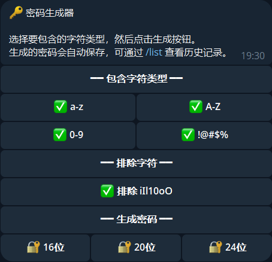

# Telegram Password Generator Bot

A private Telegram bot for generating random passwords and keeping a history of saved entries.

[中文说明 / Chinese README](./README_zh.md)

## Features

- Custom character sets: a-z, A-Z, 0-9, and `!@#$%`
- Excludes ambiguous characters: `iIl10oO`
- Quickly generates 16/20/24-character passwords
- **Manual save**: generated passwords are not stored unless you confirm via button
- **Instant refresh**: regenerate immediately if you do not like the current result
- Saved password history
- User access control
- systemd deployment example for long-running services

## Deployment Demo



## Installation

Create a virtual environment and install dependencies:

```bash
python -m venv .venv
source .venv/bin/activate
pip install -r requirements.txt
```

## Configuration

Copy the example config and edit it:

```bash
cp config.example.json config.json
```

`config.json` format:

```json
{
  "bot_token": "YOUR_BOT_TOKEN_HERE",
  "allowed_users": [123456789]
}
```

- `bot_token`: get it from [@BotFather](https://t.me/BotFather)
- `allowed_users`: list of Telegram user IDs allowed to use the bot

To get your user ID, send `/start` to the bot. Unauthorized users will receive their own user ID in the response.

By default, the bot reads and writes files relative to `bot.py`, not the shell's current working directory:

- Config: `config.json`
- Saved data: `passwords.json`

You can override these paths with environment variables:

```bash
BOT_CONFIG_FILE=/etc/random-generate-bot/config.json \
BOT_DATA_FILE=/var/lib/random-generate-bot/passwords.json \
python bot.py
```

## Local Run

This is suitable for development and testing:

```bash
python bot.py
```

For long-running production use, use systemd instead of leaving the process attached to a terminal.

## systemd Deployment

A service example is provided at:

```text
deploy/systemd/random-generate-bot.service.example
```

One possible deployment layout:

```text
/opt/random_generate_bot                # project directory
/opt/random_generate_bot/.venv/bin/python
/etc/systemd/system/random-generate-bot.service
```

Install the service:

```bash
sudo cp deploy/systemd/random-generate-bot.service.example \
  /etc/systemd/system/random-generate-bot.service
sudo nano /etc/systemd/system/random-generate-bot.service
```

Edit `WorkingDirectory`, `ExecStart`, `User`, and `Group` to match your server.

Then enable and start it:

```bash
sudo systemctl daemon-reload
sudo systemctl enable --now random-generate-bot
sudo systemctl status random-generate-bot
```

View logs:

```bash
sudo journalctl -u random-generate-bot -f
```

Restart or stop:

```bash
sudo systemctl restart random-generate-bot
sudo systemctl stop random-generate-bot
```

The example uses `Restart=on-failure`, so systemd will restart the bot after crashes, but not after an intentional `systemctl stop`.

## Security Notes

- Do not commit real `config.json`; use `config.example.json` as the template.
- `config.json` contains the Telegram bot token.
- `passwords.json` contains saved password history and is sensitive.
- Restrict permissions on production servers:

```bash
chmod 600 config.json passwords.json
```

- Back up `passwords.json` if saved password history matters.
- If a real bot token was ever committed to git history, rotate it in BotFather.

## Commands

- `/start` - show the main interface
- `/list` - view saved password records
- `/clear` - clear all saved records
